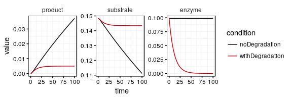
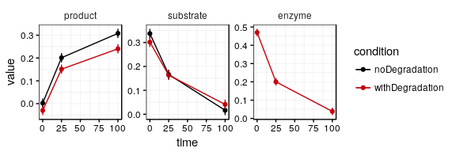
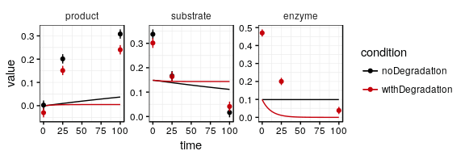
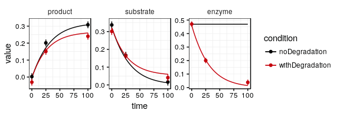
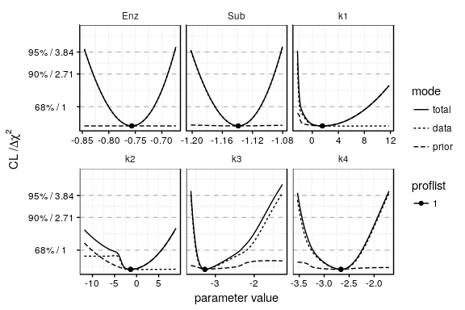

<<<<<<< HEAD
# dMod
Dynamic modeling and parameter estimation in R
=======
# dMod -- Dynamic Modeling and Parameter Estimation in R

The framework provides functions to generate ODEs of reaction networks, parameter transformations, observation functions, residual functions, etc. The framework follows the paradigm that derivative information should be used for optimization whenever possible. Therefore, all major functions produce and can handle expressions for symbolic derivatives.

## Simple example: enzyme kinetics

### Load required packages

```r
library(deSolve)
library(dMod)
```

### Generate an ODE model of enzyme kinetics with enzyme degradation

```r
# Reactions
f <- NULL
f <- addReaction(f, 
                 from = "Enz + Sub", 
                 to = "Compl", 
                 rate = "k1*Enz*Sub",
                 description = "production of complex")
f <- addReaction(f, 
                 from = "Compl", 
                 to = "Enz + Sub", 
                 rate = "k2*Compl",
                 description = "decay of complex")
f <- addReaction(f, 
                 from = "Compl", 
                 to = "Enz + Prod", 
                 rate = "k3*Compl",
                 description = "production of product")
f <- addReaction(f, 
                 from = "Enz", 
                 to = ""     , 
                 rate = "k4*Enz",
                 description = "enzyme degradation")

# ODE model
model <- odemodel(f, modelname = "enzymeKinetics")

# Prediction function
x <- Xs(model)
```

### Define observables and generate observation function `g`

```r
observables <- eqnvec(
  product = "Prod", 
  substrate = "(Sub + Compl)", 
  enzyme = "(Enz + Compl)"
)

# Generate observation functions2
g <- Y(observables, f, compile = TRUE, modelname = "obsfn", attach.input = FALSE)
```

### Define parameter transformation for two experimental conditions

```r
# Get all parameters
innerpars <- getParameters(g*x)
# Symbolically write down a log-transform
trafo1 <- trafo2 <- structure(paste0("exp(log", innerpars, ")"), names = innerpars)
# Set some initial parameters
trafo1["Compl"] <- trafo2["Compl"] <- "0"
trafo1["Prod"] <- trafo2["Prod"] <- "0"
# Set the degradation rate in the first condition to 0
trafo1["k4"] <- "0"

# Generate parameter transformation functions

p <- NULL
p <- p + P(trafo1, condition = "noDegradation")
p <- p + P(trafo2, condition = "withDegradation")
```

### Initialize parameters and make prediction

```r
# Initialize with randomly chosen parameters
set.seed(1)
outerpars <- getParameters(p)
pouter <- structure(rnorm(length(outerpars), -2, .5), names = outerpars)
times <- 0:100


plot((g*x*p)(times, pouter))
```



### Define data to be fitted by the model

```r
data <- datalist(
  noDegradation = data.frame(
    name = c("product", "product", "product", "substrate", "substrate", "substrate"),
    time = c(0, 25, 100, 0, 25, 100),
    value = c(0.0025, 0.2012, 0.3080, 0.3372, 0.1662, 0.0166),
    sigma = 0.02),
  withDegradation = data.frame(
    name = c("product", "product", "product", "substrate", "substrate", "substrate", "enzyme", "enzyme", "enzyme"),
    time = c(0, 25, 100, 0, 25, 100, 0, 25, 100),
    value = c(-0.0301,  0.1512, 0.2403, 0.3013, 0.1635, 0.0411, 0.4701, 0.2001, 0.0383),
    sigma = 0.02)
)

timesD <- sort(unique(unlist(lapply(data, function(d) d$time))))

# Compare data to prediction
plot(data) + geom_line()
```



```r
plot((g*x*p)(times, pouter), data)
```



### Define an objective function to be minimized and run minimization by `trust()`

```r
prior <- structure(rep(0, length(pouter)), names = names(pouter))
constr <- constraintL2(mu = prior, sigma = 10)

obj <- normL2(data, g*x*p) + constr

# Optimize the objective function

myfit <- trust(obj, pouter, rinit = 1, rmax = 10)

plot((g*x*p)(times, myfit$argument), data)
```




### Compute the profile likelihood to analyze parameter identifiability

```r
library(parallel)
bestfit <- myfit$argument

profiles <- do.call(rbind, 
                    mclapply(names(bestfit), 
                             function(n) profile(obj, bestfit, n, limits = c(-10, 10)), 
                             mc.cores = 4, mc.preschedule = FALSE)
)

# Take a look at each parameter
plotProfile(profiles)
```




>>>>>>> development
